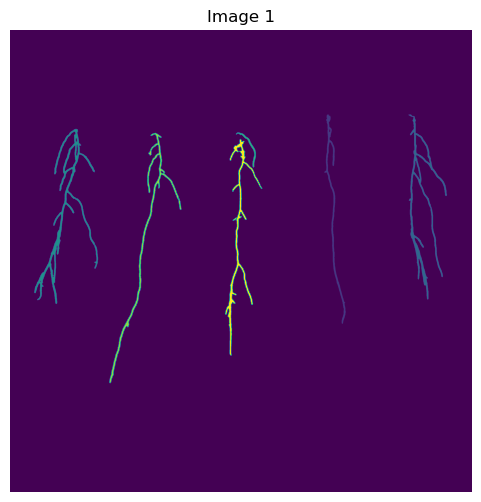
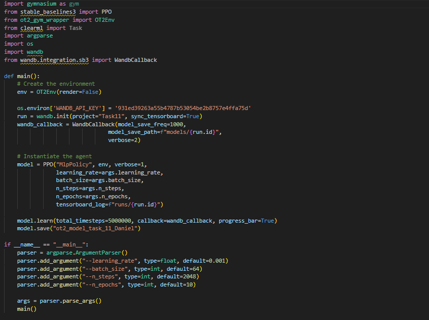

# This was the most advanced project I have worked on, with also the strictest client requirements

## We needed to create a Computer Vision pipeline that could automatically measure the length of the individual roots of the plants upon creating a photograph of them, as well as finding the very bottom of them for further inoculation by a machine in the research center.

## Afterwards, we also needed to train a Reinforcement Learning Model to inoculate the end of the root with a 1 mm accuracy

    - Step 0: Images get taken by the system

    - Step 1: Cropping the images and masks while taking into account that not all images are taken from 100% same angle

    - Step 2: Using U-NET with patches to find the roots in the pictures

    - Step 3: Cleaning up the output images using connected components

    - Step 4: Skeletonizing the roots to 1 px thickness to find the different type of connections in the image

    - Step 5: Finding the bottom most pixel of each root for the inoculation

    - Step 6: Measuring the length of each root

    - Step 7: Training the Reinforcement Learning Model

