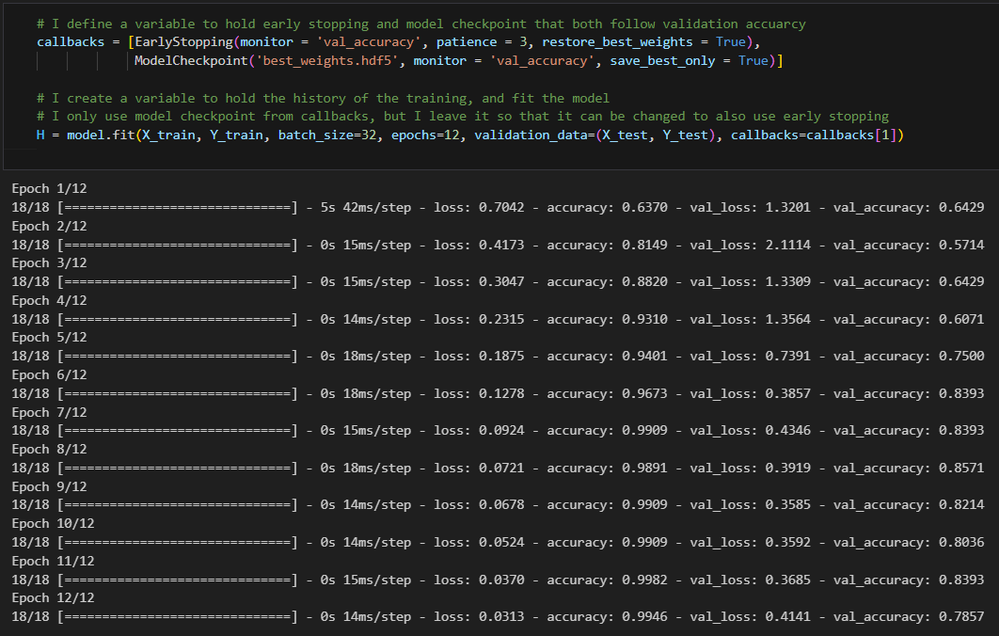

# As my first Computer Vision project, I learnt lots of things from it:
    - How Convolutional Neural Networks and their individual layers work

    - How to use GradCAM to make the model more explainable and to visualize the shortfalls of the model
 
 

    - How to use callbacks

    - And most important of all, how to use the Keras library

