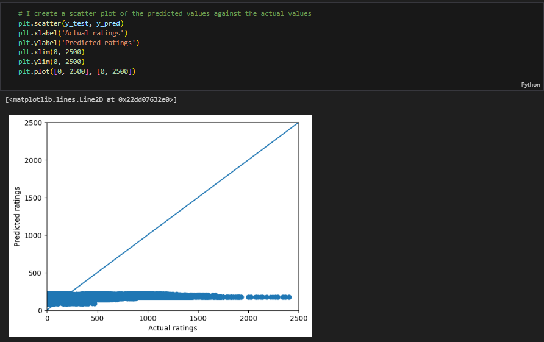

# This was my first ever Machine Learning project, meaning this is where I learnt to
    - Manipulate and clean data with Pandas

    - Merge datasets with Pandas

    - Visualize data with Matplotlib

    - Create traditional Machine Learning algorithms
